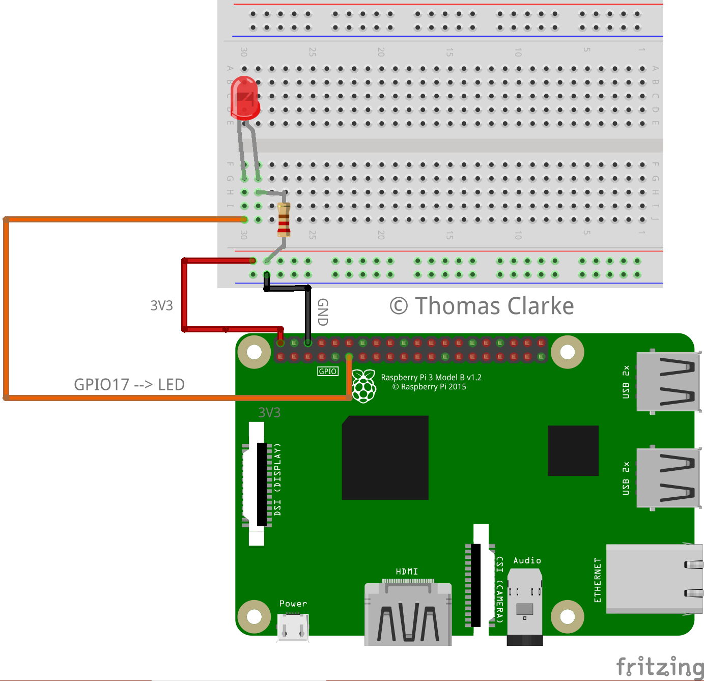

# Sample Project - LEDs
This is my first project with the Raspberry Pi, so it will be simple: exploring the world of GPIOs and components with LEDs.
I get some of my inspiration for this project from a series of Youtube videos, which I found very helpful, at 
<a href="https://www.youtube.com/watch?v=OR5h0UnMcUE&list=PLFA4eZ_bEubl_zVY-Dikk7Rpttk2xeWFv&index=1">this link</a>. All 
that this program does is turn an LED on or off depending on a user's input. This could be modified to make use of sensors,
buttons or input from other devices - and also to use different components like buzzers etc.

### Diagram

